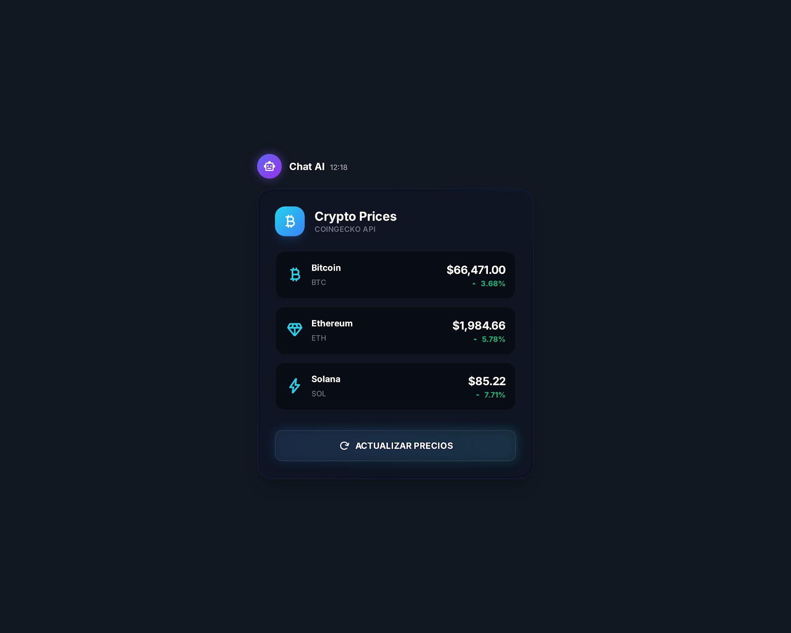

# 💬 Chat AI

  
  
  
  
  

Chat AI es un asistente conversacional para hablar con inteligencia artificial, tan sencillo de usar como cualquier app de mensajería. Escribes tu mensaje, la IA te responde al instante, y toda la conversación queda guardada en tu propio equipo — nada se envía a servidores externos salvo lo necesario para generar la respuesta.

## ¿Qué puedes hacer con él?

- 🗨️ **Conversar con la IA en tiempo real** — las respuestas van apareciendo mientras se generan, como si alguien te estuviera escribiendo.
- 🧠 **Elegir qué IA te responde** — puedes cambiar entre distintos modelos según lo que necesites.
- 💾 **Guardar tus conversaciones** — cada chat queda almacenado en tu propio navegador, listo para retomarlo cuando quieras.
- 🔍 **Buscar en tu historial** — encuentra rápido esa conversación de la semana pasada.
- 📎 **Compartir archivos** — sube imágenes o datos y consúltalos dentro de la conversación.
- 📊 **Recibir respuestas visuales, no solo texto** — cuando la pregunta lo pide, la IA abre una pequeña app interactiva dentro del propio chat (ver más abajo).
- ⭐ **Marcar tus chats favoritos** — para tener a mano las conversaciones más importantes.

## Respuestas que se convierten en mini-apps

Hay preguntas que se entienden mejor viéndolas que leyéndolas: el precio de una criptomoneda, la previsión del tiempo, los datos de un viaje. Para esos casos, el chat no responde solo con texto — abre una pequeña aplicación interactiva justo dentro de la conversación, con los datos ya cargados.

Esto es posible gracias a MCP (*Model Context Protocol*), el estándar que permite que la IA se comunique con estas mini-apps y les pase la información necesaria al vuelo, como si la conversación "invocara" la app correcta en el momento justo.

Por ejemplo, si preguntas por el precio de una criptomoneda, en vez de un bloque de texto aparece una tarjeta interactiva con el dato:

Hoy en día existen mini-apps de este tipo para el clima, la hora, criptomonedas, viajes y gráficos de datos.

## Probarlo en tu ordenador

1. Descarga el proyecto y entra en la carpeta.
2. Instala lo necesario con `pnpm install`.
3. Consigue una clave gratuita en [Groq](https://console.groq.com/) y guárdala en un archivo `.env`.
4. Arranca la aplicación con `pnpm dev` y ábrela en tu navegador.

## Estado del proyecto

El proyecto está activo y en mejora continua. Ya funciona de principio a fin: conversación con IA, historial guardado, búsqueda y una interfaz cuidada.

---

Desarrollado por [devlitus](https://github.com/devlitus) — ¡las contribuciones son bienvenidas!
