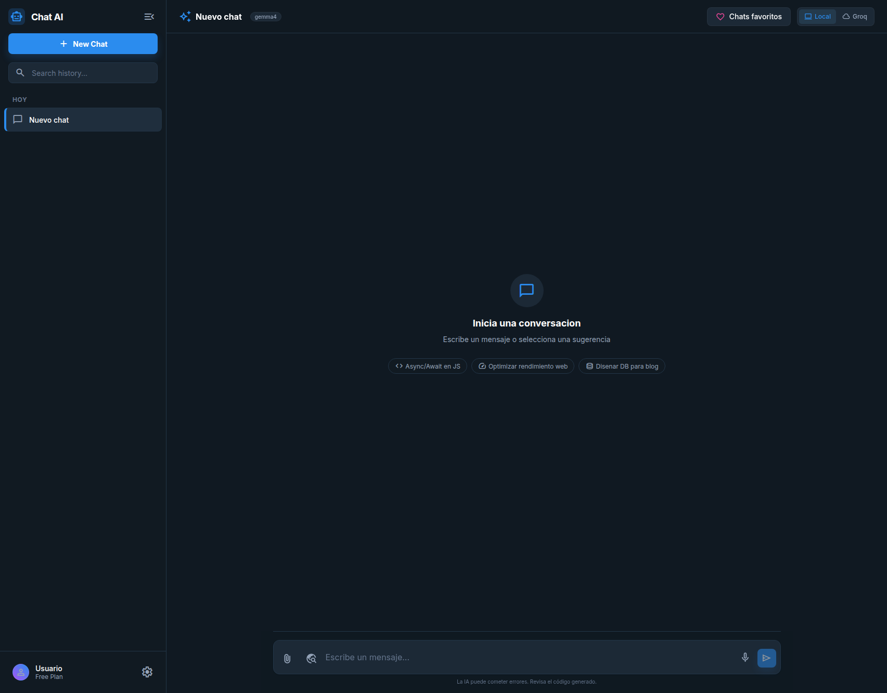

# Chat AI - Aplicación de Chat con IA

Una aplicación web moderna de chat con IA construida con **Astro 5**, **React**, y **Groq API**. MVP funcional con persistencia local, streaming en tiempo real y diseño responsivo.



## ✨ Características

- 🤖 **Chat con IA en tiempo real** - Streaming de respuestas con Groq API
- 💾 **Persistencia local** - IndexedDB para chats y mensajes (sin servidor)
- 🎨 **Interfaz moderna** - Diseño profesional con CSS global
- ⚡ **Performance** - Server-side rendering + React island optimization
- 📝 **Markdown support** - Respuestas formateadas con soporte para código
- 🔍 **Búsqueda** - Busca en tu historial de chats
- 🧪 **49 unit tests** - Cobertura completa con Vitest

## 🚀 Quick Start

### Requisitos

- Node.js 18+
- pnpm (o npm/yarn)
- [GROQ API Key](https://console.groq.com/)

### Instalación

```bash
git clone <repository-url>
cd chat
pnpm install
echo "GROQ_API_KEY=your-api-key-here" > .env
```

### Desarrollo

```bash
pnpm dev        # Dev server
pnpm test:watch # Tests en vivo
pnpm test:ui    # UI visual
```

## 📁 Estructura

```text
chat/
├── src/
│   ├── components/react/    # Componentes React interactivos
│   ├── lib/                 # Utilidades (db, session, markdown)
│   ├── pages/               # Rutas y API endpoints
│   └── layouts/             # Layouts Astro
├── docs/                    # Documentación de diseño
├── vitest.config.ts         # Tests configuration
└── astro.config.mjs         # Astro configuration
```

## 🧪 Testing

49 unit tests con Vitest:

```bash
pnpm test              # Ejecutar tests
pnpm test:watch        # Modo watch
pnpm test:ui           # Interfaz visual
pnpm test:coverage     # Reporte de cobertura
```

**Cobertura:**

- session.ts - 11 tests
- markdown.ts - 11 tests
- db.ts - 21 tests
- api/chat.ts - 6 tests

## 🏗️ Stack Técnico

| Componente | Tecnología |
|-----------|-----------|
| Framework | Astro 5 |
| UI | React 19 |
| Estado | Context + useReducer |
| Persistencia | IndexedDB |
| IA | Groq API |
| Testing | Vitest + happy-dom |
| CSS | Plain CSS |

## 🔧 Comandos

```bash
pnpm dev               # Servidor de desarrollo
pnpm build             # Build de producción
pnpm test              # Ejecutar todos los tests
pnpm test:watch        # Tests en watch mode
pnpm test:ui           # UI visual de tests
```

## 📚 Documentación

- [plan-implementacion-tecnico.md](./docs/plan-implementacion-tecnico.md) - Arquitectura
- [plan-testing-vitest.md](./docs/plan-testing-vitest.md) - Testing
- [CLAUDE.md](./CLAUDE.md) - Guía

## 🚦 Estado

**MVP Completo** ✅

- [x] Chat con IA
- [x] Persistencia local
- [x] 49 unit tests
- [x] Streaming en tiempo real
- [x] Búsqueda en historial
- [x] Documentación

---

Desarrollado por [devlitu](https://github.com/devlitus) - ¡Contribuciones bienvenidas!
